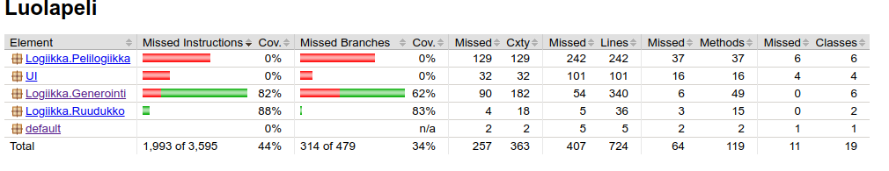

# Testausdokumentti

Projektin lopussa aika vähän loppui, joten pelilogiikka jäi JUnit testeittä.
Mutta projektia testailtiin avaamalla projekti ja painamalla "U" nappia niin monta kertaa että projekti paukautti erroria. 

Pahin error projektissa on luolageneroinnissa. Nimittäin jos luolageneraattorille antaa oikeat luvut joilla se voi kaatua, se lopulta kaatuu. Kyseessä on se että esimerkiksi 20*29 ruudukko ja sen jakaminen esimerkiksi 4 kertaa alueisiin luo jo 16 aluetta hyvin pieneen alueeseen. Jos esimerkiksi alueen jakamiskohtaa arvottaessa tulee hyvin pieni luku jo jakamisen alkuvaiheessa, on se ikävää. Ohjelma välttää tätä leikkaamalla esimerkiksi aluetta jossa vaakataso on todella pieni suosien leikkaamista pystytasolla, mutta aina tämä ei toimi.

Tätä sitten testailtiin pelin logiikkaa luodessa. Lopulta ainakin 200 kertaa putkeen U nappia painaen ei ohjelma antanut mitään erroria. Harmi juttu että se tehtiin näin, koska olisi ollut kiva jos luolageneraattori ei olisi voinut millään luvuilla koskaan kaatua.

Pelin logiikkaa testailtiin pelaamalla kunnes tulin siihen tulokseen että se on tarpeeksi hyvä. 

